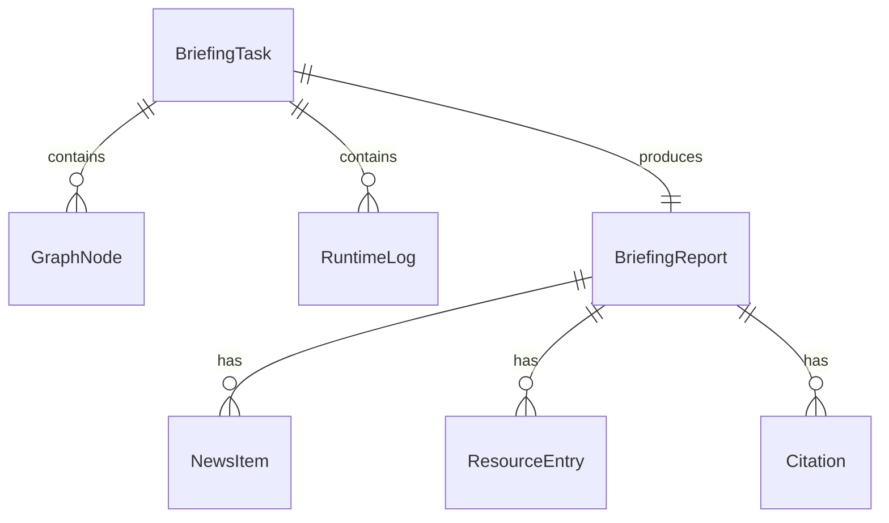

# 矿权日报 Agent 前端技术架构文档

## 1. 架构设计

```mermaid
flowchart TD
    subgraph "前端层"
        "React Frontend" --> "Vite Dev Server / Nginx"
    end
    subgraph "后端 API 层"
        "FastAPI Server" --> "REST API"
        "FastAPI Server" --> "SSE Endpoint"
    end
    subgraph "Agent 编排层"
        "LangGraph StateGraph" --> "14 个节点"
        "LangGraph StateGraph" --> "条件路由"
    end
    subgraph "MCP 工具层"
        "mining-news-mcp"
        "mineral-pdf-mcp"
        "lme-price-mcp"
    end
    "Vite Dev Server / Nginx" --> "FastAPI Server"
    "REST API" --> "LangGraph StateGraph"
    "SSE Endpoint" --> "LangGraph StateGraph"
    "14 个节点" --> "mining-news-mcp"
    "14 个节点" --> "mineral-pdf-mcp"
    "14 个节点" --> "lme-price-mcp"
```

## 2. 技术说明

- **前端框架**：React 18 + TypeScript
- **构建工具**：Vite
- **路由**：React Router v7
- **状态管理**：Zustand（轻量级，适合任务状态管理）
- **请求库**：fetch API（REST）+ EventSource（SSE）
- **Markdown 渲染**：react-markdown + remark-gfm
- **图表**：ECharts + echarts-for-react
- **图标**：lucide-react
- **样式方案**：Tailwind CSS
- **后端 API**：FastAPI + uvicorn（Python）
- **初始化工具**：vite-init（react-ts 模板）

## 3. 路由定义

| 路由 | 用途 |
|------|------|
| `/` | 首页：输入框 + 示例 + 最近报告 |
| `/briefings/:taskId/running` | 运行页：节点进度 + 实时日志 |
| `/briefings/:taskId` | 报告详情页：Markdown + 图表 + 引用源 |
| `/history` | 历史报告页：报告列表 + 搜索 |

## 4. API 定义

### 4.1 创建日报任务

```typescript
// POST /api/briefings
interface CreateBriefingRequest {
  query: string;
}

interface CreateBriefingResponse {
  task_id: string;
  status: "running";
}
```

### 4.2 监听任务事件（SSE）

```typescript
// GET /api/briefings/{task_id}/events
// SSE 事件类型
type BriefingEvent =
  | { type: "node_start"; node: string; message: string; timestamp: string }
  | { type: "node_success"; node: string; message: string; payload?: Record<string, unknown>; timestamp: string }
  | { type: "node_warning"; node: string; message: string; timestamp: string }
  | { type: "node_failed"; node: string; message: string; timestamp: string }
  | { type: "task_done"; task_id: string; report_url: string }
  | { type: "task_failed"; task_id: string; message: string };
```

### 4.3 获取报告详情

```typescript
// GET /api/briefings/{task_id}
interface BriefingReport {
  task_id: string;
  title: string;
  project: string;
  commodity: string;
  status: "success" | "failed";
  created_at: string;
  finished_at: string;
  markdown: string;
  summary: {
    news_count: number;
    resource_available: boolean;
    price_available: boolean;
    warning_count: number;
  };
  sections: {
    news: NewsItem[];
    resources: ResourceEntry[];
    price: PriceData;
    risks: string[];
  };
  citations: Citation[];
  warnings: string[];
}

interface NewsItem {
  title: string;
  url: string;
  source: string;
  published_at: string;
  summary: string;
}

interface ResourceEntry {
  category: string;
  ore_tonnage: { value: number; unit: string };
  grade: { value: number; unit: string };
  contained_metal: { value: number; unit: string };
  page: number;
  confidence: number;
}

interface PriceData {
  commodity: string;
  latest_price: number;
  unit: string;
  change_pct: number;
  ma_7: number;
  ma_30: number;
  trend: "up" | "down" | "flat";
  observations: string[];
}

interface Citation {
  title: string;
  url: string;
  type: "news" | "pdf" | "price";
}
```

### 4.4 下载 Markdown

```typescript
// GET /api/briefings/{task_id}/download
// 返回: Content-Type: text/markdown, Content-Disposition: attachment
```

### 4.5 获取历史报告

```typescript
// GET /api/briefings?page=1&page_size=20&keyword=Pilbara
interface BriefingListResponse {
  items: BriefingListItem[];
  total: number;
}

interface BriefingListItem {
  task_id: string;
  title: string;
  project: string;
  commodity: string;
  status: string;
  created_at: string;
  warning_count: number;
}
```

## 5. 服务器架构图

```mermaid
flowchart LR
    subgraph "FastAPI Backend"
        "API Router" --> "Task Manager"
        "Task Manager" --> "LangGraph Runner"
        "LangGraph Runner" --> "Event Emitter"
        "Event Emitter" --> "SSE Stream"
        "Task Manager" --> "In-Memory Store"
    end
    "LangGraph Runner" --> "MCP Clients"
    "MCP Clients" --> "MCP Servers"
```

后端采用 FastAPI，核心组件：
- **API Router**：处理 REST 请求（创建任务、获取报告、下载、列表）
- **Task Manager**：管理任务生命周期，分配 task_id，后台运行 LangGraph
- **LangGraph Runner**：异步执行 LangGraph 图，捕获节点事件
- **Event Emitter**：将节点事件通过 SSE 推送到前端
- **In-Memory Store**：demo 版使用内存存储任务状态和报告

## 6. 数据模型

### 6.1 前端状态模型



### 6.2 Zustand Store 定义

```typescript
interface BriefingStore {
  // 当前任务
  taskId: string | null;
  query: string;
  status: "idle" | "running" | "success" | "failed";

  // 节点状态
  nodes: GraphNodeState[];

  // 运行日志
  logs: RuntimeLog[];

  // 警告
  warnings: string[];
  error: string | null;

  // 报告
  report: BriefingReport | null;

  // 历史报告
  history: BriefingListItem[];
  historyTotal: number;

  // Actions
  createBriefing: (query: string) => Promise<string>;
  startListening: (taskId: string) => void;
  stopListening: () => void;
  fetchReport: (taskId: string) => Promise<void>;
  fetchHistory: (page?: number, keyword?: string) => Promise<void>;
  reset: () => void;
}
```

## 7. 前端工程目录

```text
frontend/
├── public/
├── src/
│   ├── app/
│   │   ├── App.tsx
│   │   └── router.tsx
│   ├── pages/
│   │   ├── HomePage.tsx
│   │   ├── BriefingRunningPage.tsx
│   │   ├── BriefingDetailPage.tsx
│   │   └── HistoryPage.tsx
│   ├── components/
│   │   ├── layout/
│   │   │   ├── AppShell.tsx
│   │   │   └── Header.tsx
│   │   ├── briefing/
│   │   │   ├── PromptInput.tsx
│   │   │   ├── ExamplePrompts.tsx
│   │   │   ├── GraphProgress.tsx
│   │   │   ├── RuntimeLogPanel.tsx
│   │   │   ├── ReportHeader.tsx
│   │   │   ├── MarkdownReport.tsx
│   │   │   ├── CitationList.tsx
│   │   │   ├── WarningBanner.tsx
│   │   │   ├── ResourceTable.tsx
│   │   │   ├── PriceTrendChart.tsx
│   │   │   └── RiskList.tsx
│   │   └── common/
│   │       ├── Button.tsx
│   │       ├── Card.tsx
│   │       ├── Badge.tsx
│   │       ├── EmptyState.tsx
│   │       └── LoadingSpinner.tsx
│   ├── hooks/
│   │   ├── useCreateBriefing.ts
│   │   ├── useBriefingEvents.ts
│   │   ├── useBriefingReport.ts
│   │   └── useDownloadReport.ts
│   ├── services/
│   │   ├── briefingApi.ts
│   │   └── sseClient.ts
│   ├── store/
│   │   └── briefingStore.ts
│   ├── types/
│   │   └── briefing.ts
│   ├── styles/
│   │   └── globals.css
│   └── main.tsx
├── index.html
├── package.json
├── tsconfig.json
├── vite.config.ts
├── tailwind.config.js
├── postcss.config.js
├── Dockerfile
├── nginx.conf
└── README.md
```
